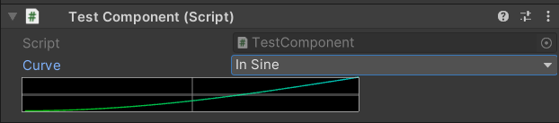
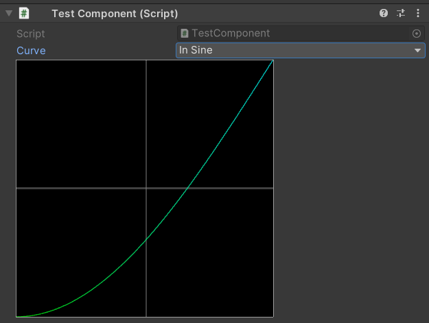

# Easing - LRTools
Grant an easier and flexible way to use easing in unity.

## How to install
Go to your unity's root project.\
Under the folder `Packages` open the file `Manifest.json`.\
Add the package and his dependencies to the project :
```json
{
  "dependencies": {
    ...
    "com.lrtools.utility":"https://github.com/Unity-LRTools/Utility.git",
    "com.lrtools.easing":"https://github.com/Unity-LRTools/Easing.git",
  }
}
```

## Documentation
Allow you to simply use easing curve for anything. 
With the help of : [easings.net](https://easings.net).

### Easing
Available and implemented easing curve :
```csharp
public enum Ease
{
    Linear,         
    InSine,         
    OutSine,        
    InOutSine,      
    InCubic,        
    OutCubic,       
    InOutCubic,     
    InQuart,        
    OutQuart,       
    InOutQuart,     
    InQuint,        
    OutQuint,       
    InOutQuint,     
    InExpo,         
    OutExpo,        
    InOutExpo,      
    InCirc,         
    OutCirc,        
    InOutCirc,      
    InBack,         
    OutBack,        
    InOutBack,      
    InElastic,      
    OutElastic,     
    InOutElastic,   
    InBounce,       
    OutBounce,      
    InOutBounce,    
}
```
How to use the easing class and extension.
```csharp
void Example() 
{
    Ease curve = Ease.InQuart;
    float min = 0f;
    float max = 10f;
    float t = 0.5f; // [0,1]
    float finalValue = Mathf.Lerp(min, max, curve.Evaluate(t));
}
```
### Custom inspector
In custom inspector you can use `EaseGUILayout` static class to help you draw layout.\
```csharp
Ease curve;
bool drawPreview = true;
void OnGUI() 
{
    curve = EaseGUILayout("Label", curve, drawPreview);
}
```
If you want to draw a preview without inspector, use the `[EasePreview]` attribute.

Folded:\
\
Unfolded:\
\
